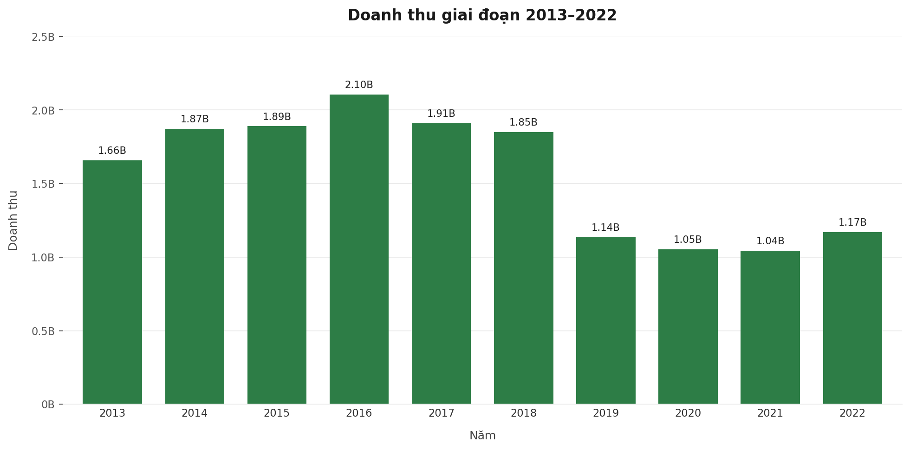
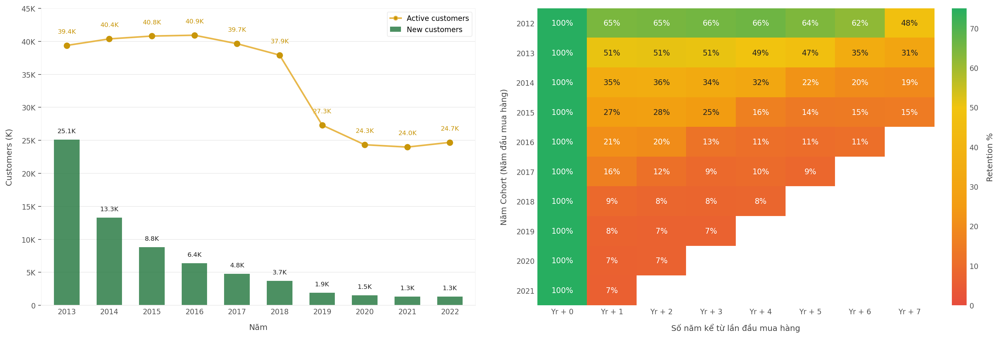
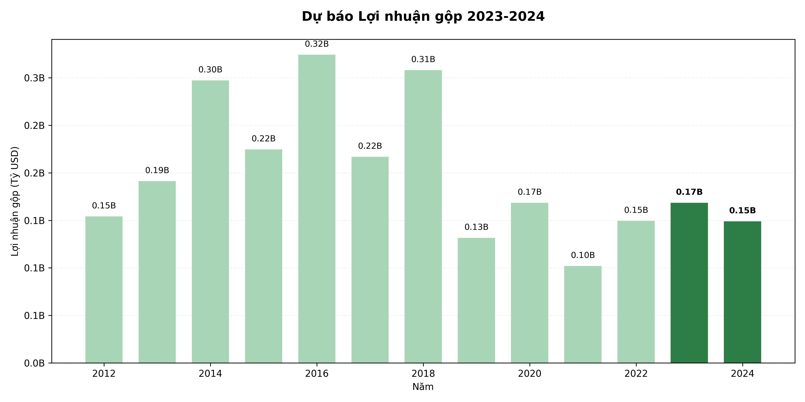

# VinUni Datathon 2026 - Round 1

This repository contains the Round 1 submission for **Datathon 2026 - The Gridbreaker**, focused on business analytics and sales forecasting for a simulated Vietnamese fashion e-commerce company.

The submission includes exploratory analysis, visualization scripts, forecasting code, generated figures, the final report, and the Kaggle submission file.

## Submission Highlights

- **Part 1 - Data questions:** notebook-based calculations for the multiple-choice section.
- **Part 2 - EDA and business insights:** visual analysis of revenue, gross profit, customer growth, and retention patterns.
- **Part 3 - Sales forecasting:** LightGBM-based forecasting pipeline for daily `Revenue` and `COGS`.
- **Final artifacts:** `submission.csv` and `reports/Datathon_report.pdf`.

## Key Visualizations

### Revenue Trend



### Customer Growth and Retention



### Gross Profit Forecast



More generated figures are available in `reports/figures/`, and the full analysis is summarized in `reports/Datathon_report.pdf`.

## Repository Structure

```text
.
├── data/                  # Local raw CSV files, ignored by git
├── notebooks/             # Part 1 and baseline notebooks
├── reports/               # Final reports and problem statement
│   └── figures/           # Generated EDA and forecasting figures
├── src/
│   ├── part_2/            # Visualization and analysis scripts
│   └── part_3/            # Sales forecasting model
├── submission.csv         # Final Kaggle submission
├── requirements.txt
└── README.md
```

## Data Access

Raw competition CSV files are not committed to this repository. Download the data from Google Drive:

https://drive.google.com/drive/folders/1G8TC9KNA4Ar2LIzl9cpn7CuWsp6JA2Vo?usp=sharing

Place the CSV files directly under `data/` before running the code:

```text
data/sales.csv
data/sample_submission.csv
data/orders.csv
data/order_items.csv
data/promotions.csv
data/web_traffic.csv
```

Additional CSV files from the provided dataset can also be placed in the same `data/` directory. The repository intentionally ignores `data/*.csv` to keep the GitHub repo lightweight and avoid redistributing raw data.

## Setup

```bash
pip install -r requirements.txt
```

## Reproduce the Forecast

Run the final forecasting pipeline from the repository root:

```bash
python src/part_3/model_34.py
```

The script trains the model using the local `data/` files and writes the final submission format to:

```text
submission.csv
```

## Regenerate Figures

Run any script in `src/part_2/` from the repository root. Generated charts are saved to `reports/figures/`.

Example:

```bash
python src/part_2/revenue.py
python src/part_2/merge_2.py
python src/part_2/forecast_gross_profit.py
```

## Main Artifacts

- `submission.csv` - final Kaggle submission file.
- `reports/Datathon_report.pdf` - final written report.
- `src/part_3/model_34.py` - final forecasting model.
- `notebooks/part_1.ipynb` - notebook for Part 1 calculations.

## Reproducibility Notes

- The forecasting script sets a fixed random seed.
- All model features are generated from the provided competition data.
- No external datasets are required.
- Raw data must be placed locally in `data/` before running the code.
